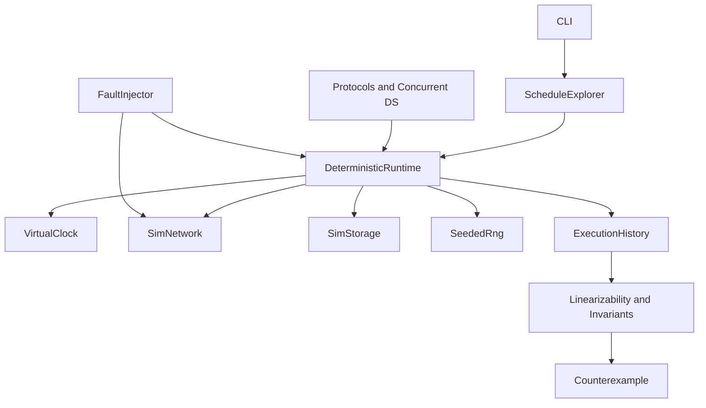

# Crucible

A deterministic simulation and systematic concurrency forge written entirely in C#.

Drop concurrent algorithms and distributed protocols into a single-threaded,
seed-reproducible runtime. The explorer owns the schedule. The fault injector
owns the network. Safety properties either hold — or you get a replayable
counterexample.

Inspired by the same idea behind FoundationDB's simulation testing, Microsoft
Coyote, and Jepsen: if nondeterminism is under your control, bugs become
experiments instead of folklore.



## What it does

- **Deterministic runtime** — virtual clock, cooperative tasks, seeded RNG, simulated network and storage
- **Schedule exploration** — DFS and PCT (probabilistic concurrency testing), plus exact schedule replay
- **Fault model** — crash/restart, drop/delay/reorder/duplicate, asymmetric partitions, clock skew
- **Protocols** — Raft, simplified Multi-Paxos, two-phase commit, gossip membership, CRDTs (OR-Set, LWW-Register, RGA)
- **Checking** — execution histories, Wing–Gong-style linearizability, invariant predicates, serialized counterexamples
- **Structures under test** — Treiber stack, Michael–Scott queue, striped map, actor mailbox

## Quickstart

```bash
dotnet build
dotnet test

# Explore Raft under partitions for a fixed seed
dotnet run --project src/Crucible.Cli -- explore --workload raft --seed 42 --max-steps 5000

# Replay a failing schedule
dotnet run --project src/Crucible.Cli -- replay --schedule out/failing.schedule.json

# Run a CRDT convergence stress
dotnet run --project src/Crucible.Cli -- run --workload or-set --seed 7 --nodes 5
```

## Source map

| Path | Contents |
|------|----------|
| `src/Crucible.Abstractions` | Node ids, messages, clocks, properties, scheduling points |
| `src/Crucible.Runtime` | Virtual clock, cooperative scheduler, sim network/storage, RNG |
| `src/Crucible.Concurrency` | DFS/PCT explorers, choice points, schedule recording and replay |
| `src/Crucible.Faults` | Crash, partition graphs, message corruption schedules |
| `src/Crucible.Checking` | Histories, linearizability, invariants, counterexamples |
| `src/Crucible.Protocols` | Raft, Paxos, 2PC, gossip, CRDTs |
| `src/Crucible.Structures` | Concurrent data structures exercised by the explorer |
| `src/Crucible.Cli` | `run`, `explore`, `replay`, `report` |
| `tests/Crucible.Tests` | Unit, protocol safety, and explorer regression suites |
| `docs/` | Architecture, runtime model, protocol notes, ADRs |

Deeper reading: [`docs/architecture.md`](docs/architecture.md).

## What works / what is not claimed

Working: deterministic single-threaded simulation, DFS/PCT exploration, schedule
replay, Raft election + log replication under partitions, 2PC abort/commit,
CRDT convergence under reordering, linearizability checks for register/queue/set.

Not claimed: multi-process cluster execution, production Raft deployment,
exhaustive verification for unbounded state spaces, or formal TLA+ export.

## License

MIT. See [LICENSE](LICENSE).
