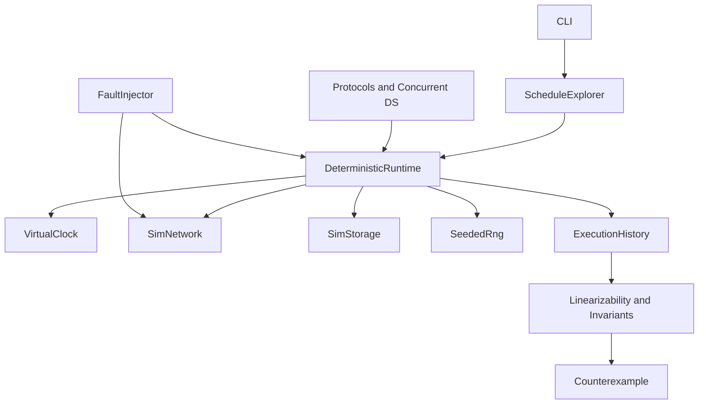

# Crucible

A deterministic simulation and systematic concurrency forge written entirely in C#.

Drop concurrent algorithms and distributed protocols into a single-threaded,
seed-reproducible runtime. The explorer owns the schedule. The fault injector
owns the network. Safety properties either hold — or you get a replayable
counterexample.

Inspired by the same idea behind FoundationDB's simulation testing, Microsoft
Coyote, and Jepsen: if nondeterminism is under your control, bugs become
experiments instead of folklore.


```mermaid
flowchart TB
  CLI[CLI] --> Explorer[ScheduleExplorer]
  Explorer --> Runtime[DeterministicRuntime]
  Runtime --> Clock[VirtualClock]
  Runtime --> Net[SimNetwork]
  Runtime --> Store[SimStorage]
  Runtime --> RNG[SeededRng]
  Workloads[Protocols and Concurrent DS] --> Runtime
  Faults[FaultInjector] --> Net
  Faults --> Runtime
  Runtime --> History[ExecutionHistory]
  History --> Checker[Linearizability and Invariants]
  Checker --> Report[Counterexample]
```

## What it does

- **Deterministic runtime** — Virtual clock advancing on idle, atomic transitions (single message delivery, single timer firing, single process step, single fault, single client operation), independent RNG streams, per-node clock views.
- **Bounded exploration** — Systematic bounded DFS with strict prefix validation and canonical branching, Burckhardt PCT (probabilistic concurrency testing with stable priorities and $d-1$ change points), and uniform random exploration.
- **Strict schedule replay** — Versioned schedule trace serialization (`.schedule.json`) that strictly validates transition keys, candidate counts, and chosen indices without silent clamping.
- **Fault injection** — Process crash/restart with durable state reload, asymmetric/symmetric network partitions, partition healing, targeted message drops, message delays, and clock skew.
- **Distributed protocols** — Raft (leader election, term safety, quorum commit before client ack, log conflict backtracking, and state machine persistence), simplified Multi-Paxos, Two-Phase Commit, gossip membership, and state-based CRDTs (OR-Set, LWW-Register, RGA).
- **Linearizability checking** — Wing–Gong linearizability verification over finite execution histories for registers, Treiber stack, and Michael–Scott queue specifications.

## Exploration strategies

Exploration in Crucible is explicitly **bounded** by step bounds and schedule limits:

1. **PCT (Probabilistic Concurrency Testing)**: Assigns stable priority values to actors and inserts a bounded number ($d-1$) of priority change points at randomly sampled steps. Provides theoretical bug-depth guarantees without unbounded state-space explosion.
2. **DFS (Depth-First Search)**: Strictly replays recorded prefix choices, branches across alternate candidate transitions at a designated frontier step up to depth bounds, and explores canonical suffixes.
3. **Random**: Samples candidate transitions uniformly at each step using a dedicated seeded RNG stream.

## Run classifications

Every execution produces an explicit classification:

- `Completed` — Protocol workload ran to completion (all client operations completed).
- `Quiescent` — No further transitions are enabled; all inboxes, in-flight messages, and timers are drained.
- `SafetyViolation` — An invariant failed during execution or at quiescence.
- `StepBoundExhausted` — The maximum configured step limit was reached while events were still active. Treated as *inconclusive* when `--require-quiescence` is set.
- `ReplayDivergence` — During replay, enabled transitions or candidate keys diverged from the recorded trace.

## CLI exit codes

- `0` — Success (Completed, Quiescent, or clean bounded run).
- `1` — Command-line syntax error, invalid arguments, or unknown workload.
- `2` — Safety invariant violation detected.
- `3` — Replay divergence detected.
- `4` — Inconclusive run (step bound exhausted when quiescence was required).

## Quickstart

```bash
# Build with zero warnings
dotnet build --configuration Release

# Run test suite
dotnet test --configuration Release --no-build

# List supported workloads
dotnet run --project src/Crucible.Cli --configuration Release --no-build -- list

# Run a Raft simulation scenario (advances virtual time, delivers messages, elects leader, commits entries)
dotnet run --project src/Crucible.Cli --configuration Release --no-build -- run --workload raft --seed 42 --nodes 5 --max-steps 2000

# Run OR-Set CRDT convergence under churn
dotnet run --project src/Crucible.Cli --configuration Release --no-build -- run --workload or-set --seed 42 --nodes 5 --max-steps 2000

# Explore Two-Phase Commit using genuine PCT
dotnet run --project src/Crucible.Cli --configuration Release --no-build -- explore --workload two-phase-commit --strategy pct --schedules 5 --steps 100

# Replay a recorded schedule trace
dotnet run --project src/Crucible.Cli --configuration Release --no-build -- replay --schedule out/trace.schedule.json
```

## Verified Raft progress example

```text
$ dotnet run --project src/Crucible.Cli --configuration Release --no-build -- run --workload raft --seed 42 --nodes 5 --max-steps 2000
seed=42 time=2227t steps=2000 digest=f303c3e1e45083ff
net: sent=939 dropped=13 delivered=925 inFlight=1
  n0 state=Running inbox=0 skew=0
  n1 state=Running inbox=0 skew=0
  n2 state=Running inbox=1 skew=0
  n3 state=Running inbox=0 skew=0
  n4 state=Running inbox=0 skew=0

OK workload=raft seed=42 steps=2000 (classification=StepBoundExhausted)
```

## Verified counterexample and replay example

When a buggy concurrency implementation or protocol violation is encountered during exploration:

```bash
# Discover bug and write schedule trace
dotnet run --project src/Crucible.Cli -- explore --workload lost-update --strategy dfs --out out/
# Emits counterexample: out/dfs-42.schedule.json and exits with code 2

# Strictly reproduce the exact same violation at the identical logical step
dotnet run --project src/Crucible.Cli -- replay --schedule out/dfs-42.schedule.json
# Exits with code 2 (Safety violation reproduced)
```

If the schedule is corrupted or tampered with:
```bash
dotnet run --project src/Crucible.Cli -- replay --schedule out/corrupted.schedule.json
# REPLAY DIVERGENCE: Replay divergence at step #0: expected DeliverMessage on actor 1 key=client:0, but got ...
# Exits with code 3 (Replay divergence)
```

## Source map

| Path | Contents |
|------|----------|
| `src/Crucible.Abstractions` | Node IDs, message envelopes, virtual clocks, scheduling keys, properties |
| `src/Crucible.Runtime` | Atomic transition event loop, virtual time advance, SimNetwork, SimStorage, SimSharedMemory |
| `src/Crucible.Concurrency` | Bounded DFS, Burckhardt PCT, random explorer, schedule serialization version 1, delta-debugging minimizer |
| `src/Crucible.Faults` | Crash, restart, symmetric/asymmetric partition graphs, drop, delay, clock skew |
| `src/Crucible.Checking` | Execution histories, Wing–Gong linearizability checker, sequential specifications, invariants |
| `src/Crucible.Protocols` | Raft, Multi-Paxos, Two-Phase Commit, gossip membership, CRDTs (OR-Set, LWW-Register, RGA) |
| `src/Crucible.Structures` | Faithful lock-free Treiber stack and Michael–Scott queue over simulated memory |
| `src/Crucible.Cli` | CLI application (`run`, `explore`, `replay`, `report`, `list`) |
| `tests/Crucible.Tests` | Property theories, protocol correctness scenarios, fault verification, CLI integration tests |
| `docs/` | Architecture specification and machine-verified evidence |

## License

MIT. See [LICENSE](LICENSE).
