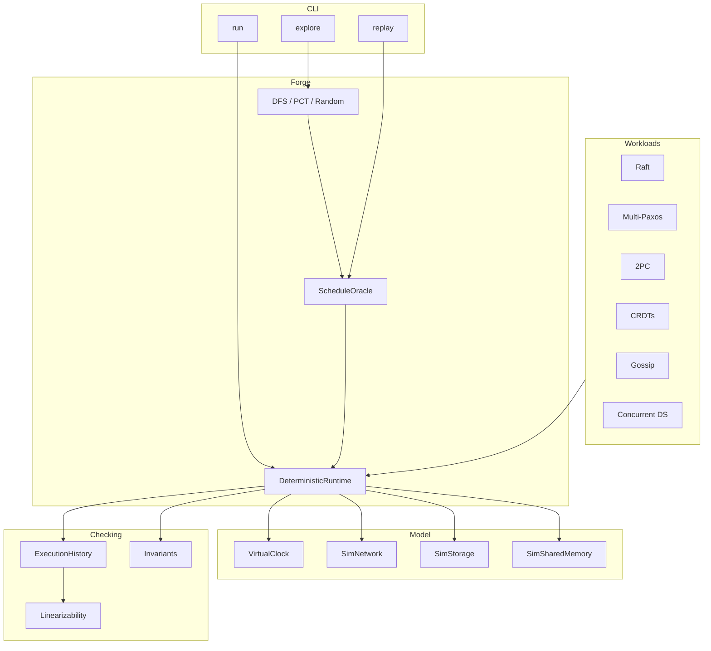

# Architecture

Crucible is a single-threaded, seed-reproducible simulation engine for concurrent
and distributed systems. Real parallelism is intentionally absent: every
nondeterministic choice flows through a schedule oracle, so failures become
artifacts you can replay.

## Design principles

1. **Cooperative processes** — `ISimProcess` implementations react to messages and
   timers. They never block on real time.
2. **Discrete steps** — Each step selects one enabled transition (deliver, timer,
   process work, client drive, fault).
3. **Explicit faults** — Partitions, crashes, and message loss are scheduled
   events, not ambient noise.
4. **Checking is external** — Protocols record histories; checkers validate
   linearizability and invariants after execution or during exploration.

## Project map

| Assembly | Role |
|----------|------|
| `Crucible.Abstractions` | Shared types: time, messages, scheduling, properties |
| `Crucible.Runtime` | Clock, network, storage, scheduler, shared memory |
| `Crucible.Concurrency` | Explorers, schedule serialization, replay |
| `Crucible.Faults` | Partition schedules, chaos profiles |
| `Crucible.Checking` | Histories, linearizability, counterexamples |
| `Crucible.Protocols` | Raft, Paxos, 2PC, gossip, CRDTs |
| `Crucible.Structures` | Lock-free structures over simulated memory |
| `Crucible.Cli` | User-facing commands |
